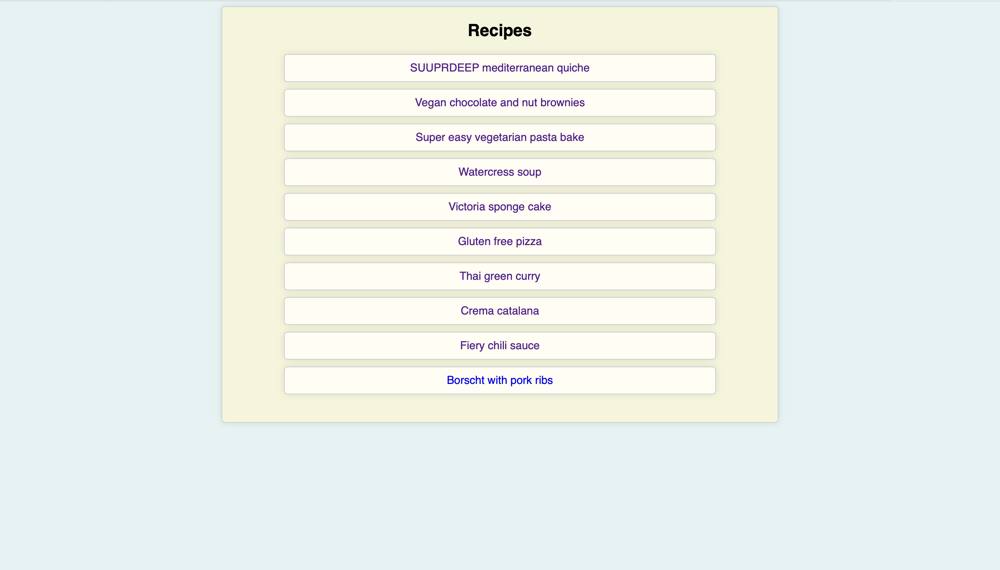
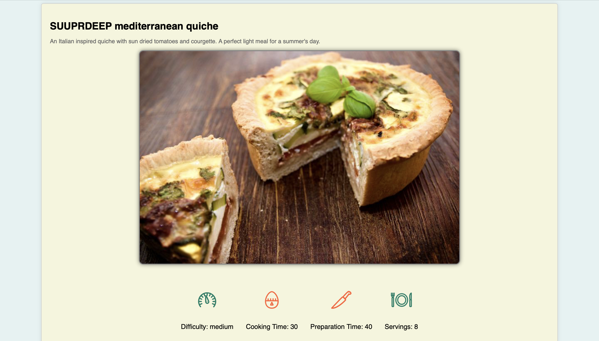
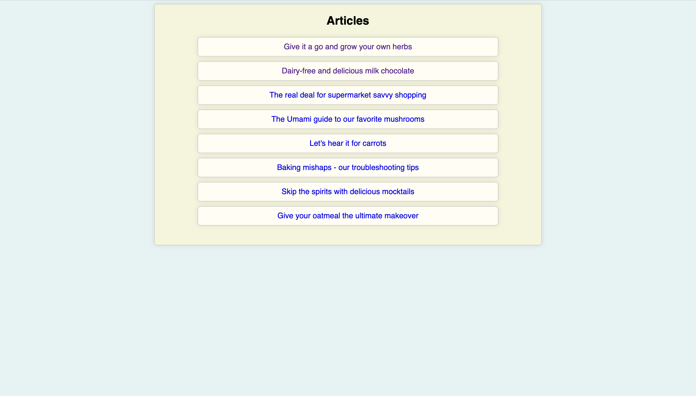
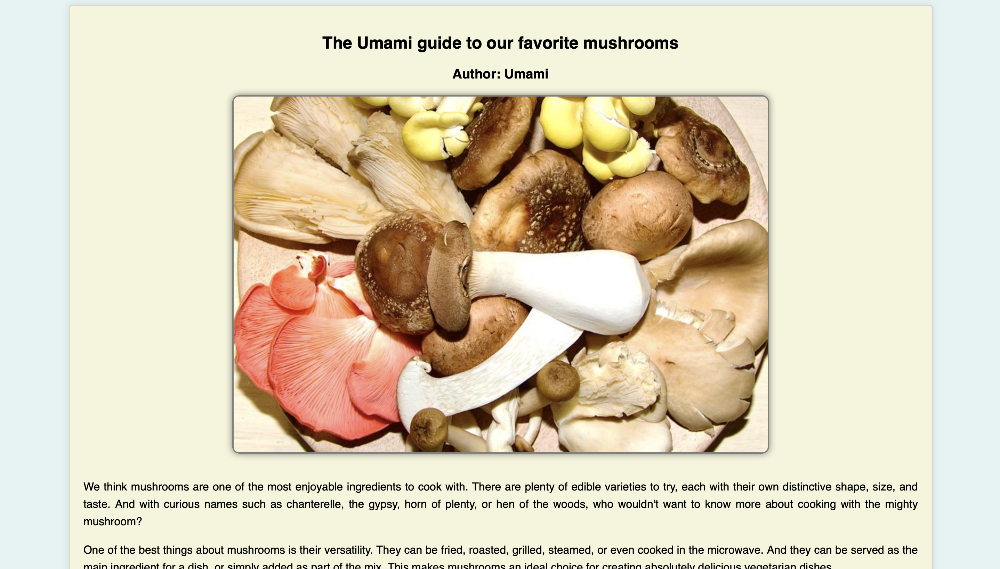

<h1 align="center"> 🍽️ CSC496 Recipe Website </h1>

Welcome to the **CSC496 Recipe Website**, a delightful collection of mouth-watering recipes and insightful articles! This static site, built with the power of Gatsby and React, brings you a seamless browsing experience while tantalizing your taste buds. 🤤

## 🌟 Features

- 📝 Browse an extensive list of recipes and articles sourced from a Drupal backend
- 🔍 Dive into individual recipe and article pages, dynamically generated for your convenience
- 💅 Immerse yourself in a visually stunning design, crafted with Styled Components
- 📱 Enjoy a responsive layout that adapts perfectly to any device
- 🚀 Automated build and deployment with GitHub Actions

## 🚀 Getting Started

If you want to run the project locally or contribute to its development, follow these steps:

### 📥 Installation

1. Clone the repository:
```
git clone https://github.com/saxcrawford/csc496.git
```
2. Navigate to the project directory:
```
cd csc496
```
3. Install the dependencies:
```
npm install
```
### 🏃‍♀️ Usage

1. Start the development server:
```
gatsby develop
```
2. Open your browser and visit `http://localhost:8000` to view the website.

3. The GitHub workflow will automatically handle the Gatsby build and deployment processes whenever changes are pushed to the repository.

## 🗂️ Project Structure

- `src/pages/`: Contains the main pages of the website (index, recipes, articles)
- `src/templates/`: Contains the templates for individual recipe and article pages
- `src/components/`: Contains reusable components used throughout the website
- `gatsby-node.js`: Contains the logic for creating dynamic pages based on Drupal data
- `gatsby-config.js`: Contains the website configuration and plugin settings
- `.github/workflows/`: Contains the GitHub Actions workflow configuration

## 📸 Screenshots

### 🍳 Recipe Page



### 📰 Article Page



🍽️ Happy cooking and happy coding! 👨‍💻👩‍💻
